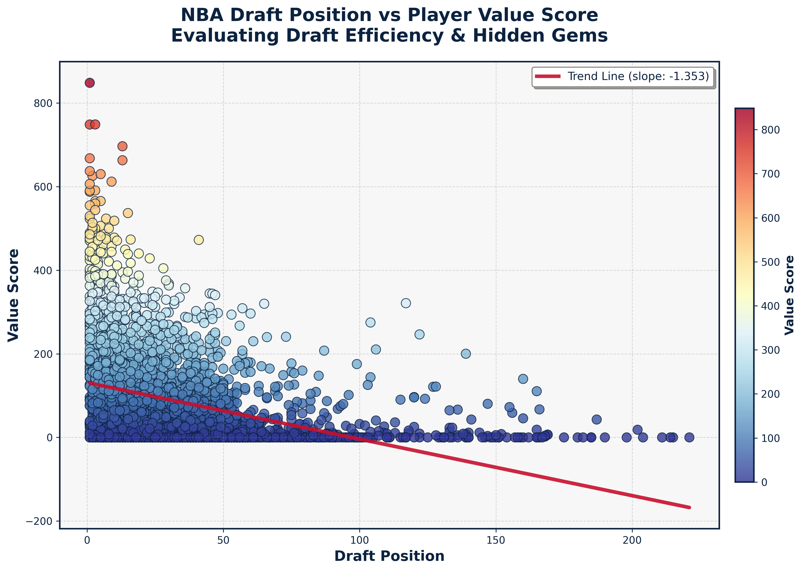
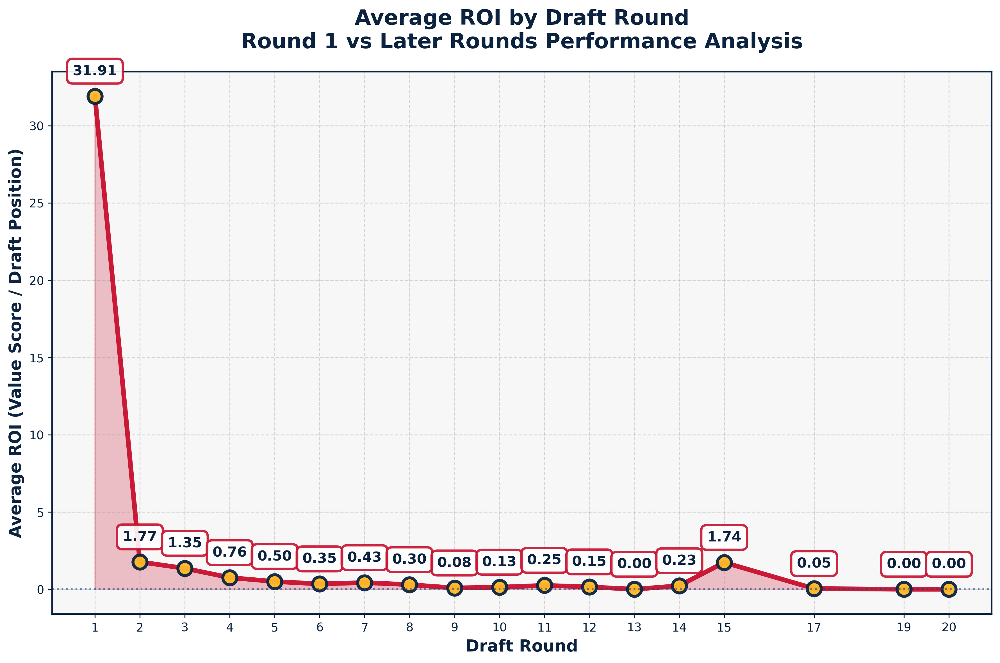

# NBA Draft Pick ROI Analysis

This project analyzes the value NBA players provided relative to their draft pick position. It highlights undervalued players, draft round trends, and positional performance.

**Live Demo**: [View Streamlit App](https://nba-drafts-roi-analysis-0.streamlit.app/)

---

## Overview

Using historical NBA player data, this project calculates a custom "value score" based on career totals and compares it to draft number. Key questions include:

- Which draft picks delivered the highest return?
- Do later rounds sometimes outperform earlier ones?
- Are certain positions or teams better at finding talent?

---

## Dataset

- **Source**: [Kaggle – NBA Players Database](https://www.kaggle.com/datasets/yagizfiratt/nba-players-database)
- Includes: Player names, career stats (PTS, REB, AST), position, draft year/round/number, height, weight, team, country

---

## Methodology

- **Value Score** = (`PTS + REB + AST`) × career length
- **Draft ROI** = `Value Score / Draft Number`
- Players without a draft number or complete stats were excluded from ROI calculations.

---

## Dashboard Features

- View top ROI players by position or draft range
- Visualize draft trends and outliers
- Filter by draft year range and position

---

## Visuals

| Draft Number vs Value Score                         | Average ROI by Draft Round                    |
|-----------------------------------------------------|-----------------------------------------------|
|  |        |

## Contact

🌐 Portfolio: [lakhani-haya.github.io](https://lakhani-haya.github.io/) 
🔗 LinkedIn: [linkedin.com/in/haya-lakhani](https://www.linkedin.com/in/haya-lakhani)  

 : [github.com/lakhani-haya

